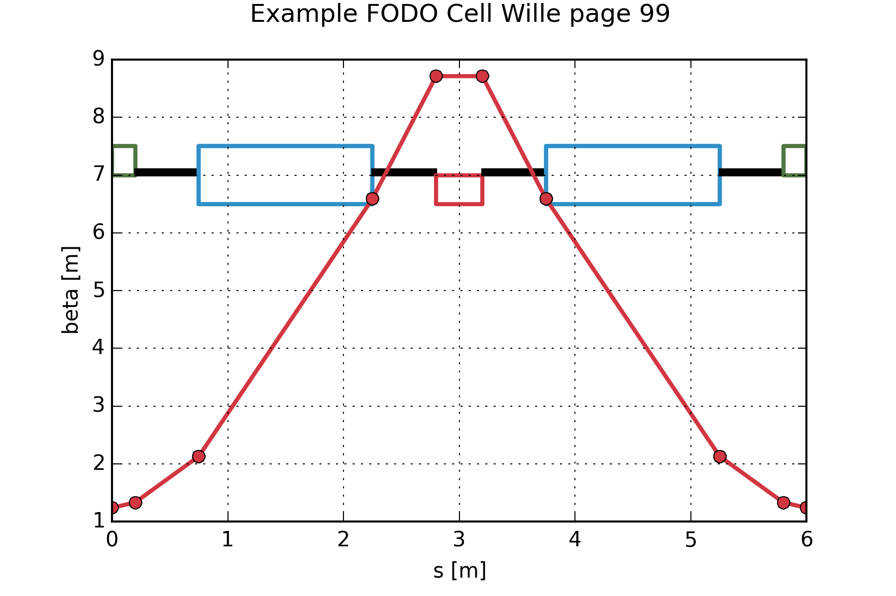

traPyc
======

**traPyc** is an optics calculator for circular accelerator machines such as synchrotrons and storage rings written in Python. The name is
a word play between (ion) traffic and Python. Currently only linear elements are supported. The calculations are done in full matrices. Optical 
elements are drawn as well as the beta functions.

The input lattice file is just text file containing rows of elements. Here is an example of a lattice showing the example of
the book of [Klaus Wille](http://www.worldcat.org/oclc/45248315) on Page 99:

    #Example FODO Cell Wille page 99
    #typ    name    len     strngth     param
    qf	    qf1     0.2     -1.2        0
    d	    drf1    0.55    0           0
    eb	    edg     0       3.8197      11.25
    b	    dip1    1.5     3.8197      0
    eb	    edg     0       3.8197      11.25
    d	    drf2    0.55    0           0
    qd	    qd1     0.4     1.2         0
    d	    drf3    0.55    0           0
    eb	    edg     0       3.8197      11.25
    b	    dip2    1.5     3.8197      0
    eb	    edge    0       3.8197      11.25
    d	    drf3    0.55    0           0
    qf	    qf2     0.2     -1.2        0

Future imports from other optics programs like MIRKO and MADX are planned!
